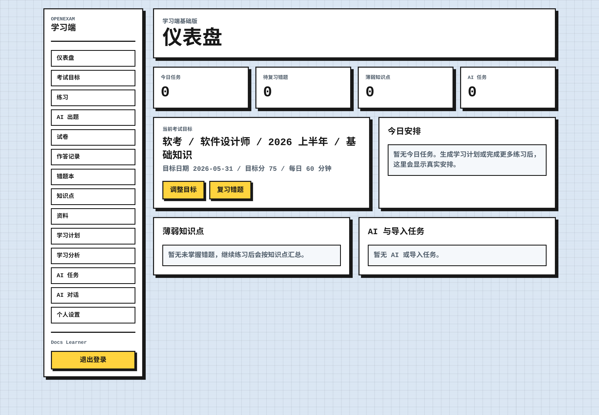
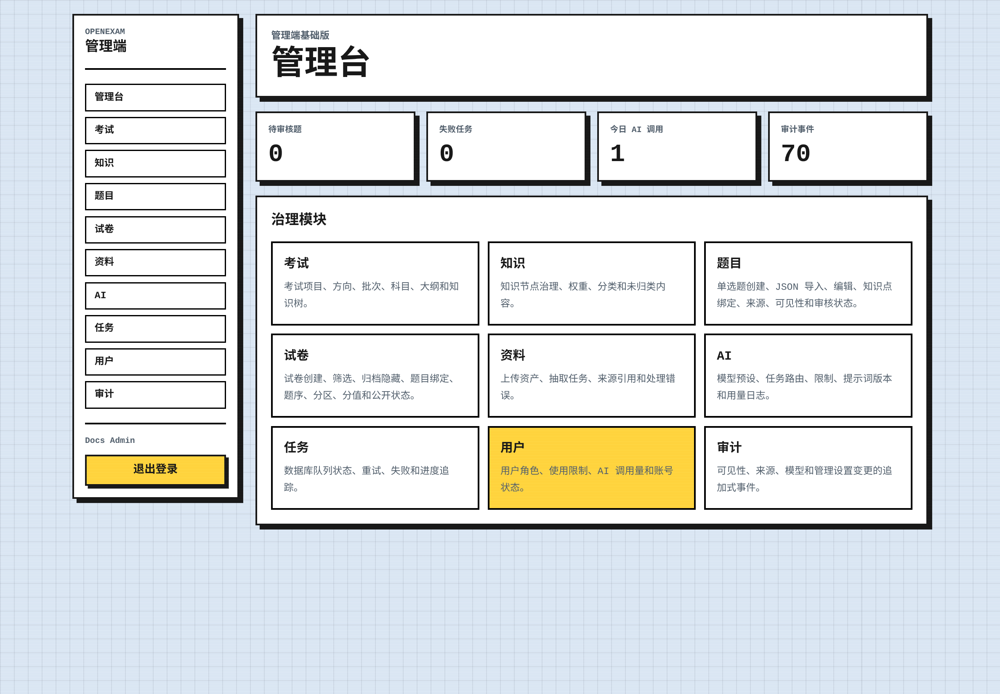

# OpenExam

<p align="center">
  
</p>

<p align="center">
  <strong>简体中文</strong> · <a href="README.md">English</a>
</p>

[](https://github.com/hacksynth/openexam/actions/workflows/ci.yml)
[](https://github.com/hacksynth/openexam/actions/workflows/docker.yml)
[](https://github.com/hacksynth/openexam/actions/workflows/codeql.yml)
[](LICENSE)
[](package.json)
[](package.json)

OpenExam 是一个面向个人学习者的自托管 AI 备考平台。MVP 首先聚焦软考软件设计师，同时保留可扩展到其他考试体系的领域模型。

## 当前状态

OpenExam 已准备为 `v0.1.0` 发布候选版本。单个 Next.js 应用同时提供学习端流程和 `/admin` 下的管理端角色路由，共享 core 包、Prisma/PostgreSQL schema、认证和会话层、考试体系管理、多题型客观题练习、试卷作答、错题本、学习分析、14 天学习计划、OpenAI/Claude/Gemini BYOK、AI 调用日志、资料上传、AI 辅助抽题、常驻 worker、错题复习卡图片生成等能力已经具备。

关键学习闭环已由 Vitest 单元/API 测试和 Playwright 浏览器流程覆盖。独立 OCR、更丰富的文件解析、更深入的主观题评阅、解题图生成、审计加固和高级练习模式仍属于后续工作。产品和架构事实源在 `docs/`。

首个产品版本默认使用简体中文 (`zh-CN`) 界面文案。

## v0.1.0 亮点

- 单个 Next.js 应用，带学习端私有路由和 `/admin` 下的管理端角色路由。
- PostgreSQL schema、Prisma migrations、seed data，以及 web、worker、database 的 Docker Compose 服务。
- 围绕考试目标的练习、公开试卷作答、答案自动保存、报告、错题入库、错题重练和薄弱点摘要。
- BYOK AI 设置、provider 调用日志、管理端模型预设、资料抽题任务、上下文对话、学习诊断和 14 天学习计划。
- 生成错题复习卡的私有资产服务。
- CI 覆盖 Prisma 校验、TypeScript 检查、Vitest、应用构建、migration deploy、Playwright 浏览器流程、Docker 镜像构建和 CodeQL 分析。

## 产品截图

| 学习端仪表盘 | 管理端仪表盘 |
| --- | --- |
|  |  |

## 文档

- `docs/product-requirements.md`：产品范围、工作流和非目标。
- `docs/architecture-decisions.md`：技术栈、路由、数据模型和治理决策。
- `docs/mvp-roadmap.md`：交付顺序和验收标准。
- `docs/design-system.md`：UI 方向和可访问性规则。
- `docs/release-v0.1.0.md`：发布范围、验收门禁和已知后续工作。
- `CHANGELOG.md`：面向用户的发布历史。
- `SUPPORT.md`：支持、bug、feature 和私密安全报告入口。
- `AGENTS.md`：仓库贡献者和 agent 指南。

## 技术栈

- Next.js App Router 和 TypeScript。
- Prisma 与 PostgreSQL。
- Tailwind CSS 和 shadcn/ui。
- 邮箱/密码认证和数据库会话。
- Vitest 单元/API 测试。
- Playwright 关键浏览器流程测试。

## 本地开发

安装依赖并启动本地 web app：

```sh
npm install
npm run prisma:generate
npm run dev:web
```

web app 默认运行在 `3000`，管理端位于 `http://127.0.0.1:3000/admin`。

常用命令：

```sh
npm run build
npm run build:web
npm run lint
npm test
npm run test:e2e
npm run worker
npm run prisma:validate
npm run prisma:generate
npx prisma migrate dev
```

推荐发布前门禁：

```sh
npm run prisma:validate
npm run lint
npm test
npm run build
npm run test:e2e
```

复制 `.env.example` 为 `.env`，并在迁移或 seed 前更新 `DATABASE_URL`、`SESSION_SECRET`、`NEXT_PUBLIC_WEB_URL` 和 `NEXT_PUBLIC_ADMIN_URL`。

设置 `ADMIN_EMAIL` 和 `ADMIN_PASSWORD` 可初始化或更新管理员账号。Docker web 服务会在 migration 后自动 bootstrap；本地开发可运行 `npm run db:bootstrap-admin` 或 `npm run db:seed`。

设置 `AI_KEY_ENCRYPTION_SECRET` 后才能保存 BYOK provider key。`OPENAI_API_KEY`、`ANTHROPIC_API_KEY` 和 `GEMINI_API_KEY` 是可选平台 fallback；用户未保存个人 key 时会使用平台 key。使用兼容网关时可设置 provider base URL。

资料上传和生成的错题复习卡图片默认使用 `STORAGE_DRIVER=local` 与 `LOCAL_STORAGE_DIR`，也可使用 `STORAGE_DRIVER=s3` 连接 S3 兼容服务，例如自托管 MinIO。`npm run worker` 处理抽题和图片生成队列；管理端 `/admin/jobs` 提供手动处理、重试、恢复和任务详情。

Playwright 会在 `127.0.0.1:8317` 启动本地 OpenAI 兼容 mock server，因此 `npm run test:e2e` 会测试真实 Responses 和 Images API adapter，但不会调用外部模型。

本地 PostgreSQL：

```sh
docker compose up -d postgres
npm run db:migrate
set -a; . ./.env; set +a; npm run db:seed
```

容器部署：

```sh
docker compose build seed
docker compose run --rm seed
docker compose up --build
```

## 仓库维护

- `.github/ISSUE_TEMPLATE/`：结构化 bug 和 feature 收集。
- `.github/PULL_REQUEST_TEMPLATE.md`：PR 摘要、测试、发布和安全检查。
- `.github/CODEOWNERS`：默认 review ownership。
- `.github/dependabot.yml`：每周依赖更新 PR。
- `.github/workflows/`：CI、Docker 镜像构建和 CodeQL code scanning。
- `.editorconfig` 和 `.gitattributes`：统一编码、换行和二进制文件处理。
- `CODE_OF_CONDUCT.md`、`CONTRIBUTING.md`、`SECURITY.md` 和 `SUPPORT.md`：社区和维护者操作规范。

## Star History

[](https://www.star-history.com/#hacksynth/openexam&Date)

## 参与贡献

OpenExam 欢迎能强化自托管学习闭环的聚焦 issue 和 pull request。适合优先贡献的方向包括测试、provider adapter、导入校验、可访问性修复、文档和小范围管理端加固。提交 PR 前请阅读 `CONTRIBUTING.md`。

## 项目结构

- `apps/web/`：学习端 Next.js 应用。
- `apps/web/app/admin/`：同一个 Next.js 应用内的管理端角色路由。
- `packages/core/`：共享领域 helper、校验 schema、路由元数据、环境变量解析和 Prisma client。
- `prisma/`：数据库 schema 和 seed 脚本。
- `tests/`：Vitest 单元测试。
- `docs/`：产品、架构、路线图和设计系统决策。

## License

OpenExam 应用代码使用 AGPL-3.0-only 授权。题目数据、上传资料和用户内容拥有独立的授权和可见性规则。
